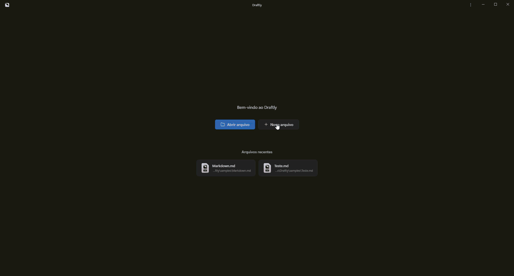

<div align="center">
  
  <h1>Draftly</h1>
  <p><b>O bloco de notas moderno para Markdown</b></p>
  <p>Um editor leve para Markdown, texto, JSON e HTML, com foco em produtividade, preview em tempo real e visual limpo.</p>
</div>

## Visao Geral

O Draftly e um aplicativo desktop para quem gosta de editar arquivos com fluidez, ver o resultado ao lado e manter um ambiente simples, bonito e organizado.

Ele foi pensado para funcionar como um bloco de notas evoluido, com:

- edicao rapida de arquivos locais
- preview renderizado de Markdown
- busca integrada
- abas
- modo dividido entre editor e visualizacao
- aparencia escura moderna
- suporte a temas
- configuracoes para ajustar a experiencia

## Telas

### Tela inicial



Na tela inicial voce pode abrir arquivos recentes, criar novos documentos e acessar rapidamente seus trabalhos mais usados.

### Editor Markdown


Aqui esta o fluxo principal do app: editar Markdown e acompanhar a renderizacao ao lado, com suporte a titulos, listas, blocos de codigo, alertas e mais.

### Busca e navegacao


A busca fica acessivel durante a edicao e ajuda a localizar conteudo rapidamente sem sair do contexto do documento.

### Configuracoes


As configuracoes permitem ajustar comportamento, tema, aparencia e preferencias gerais da aplicacao.

### Arquivos TXT


O Draftly tambem funciona bem como editor de texto simples, sem perder o visual organizado.

### Arquivos JSON


Arquivos JSON ficam legiveis com destaque adequado, mantendo a experiencia de edicao confortavel.

## Funcionalidades

- editor de Markdown com preview ao lado
- modo dividido entre editor e visualizacao
- busca integrada
- abas para varios arquivos abertos
- indicador e navegacao por secoes no documento
- alternancia de tema
- zoom da interface
- menu de acoes da janela
- abertura de arquivos locais
- salvamento e exportacao
- suporte a arquivos `.md`, `.markdown`, `.txt`, `.json`, `.html`, `.js`, `.jsx` e outros
- interface escura moderna e minimalista

## Atalhos e acoes rapidas

Algumas acoes principais estao disponiveis no topo da janela e nos menus internos do app, como:

- abrir arquivo
- salvar
- salvar como
- exportar para HTML
- exportar para PDF
- alternar abas
- alternar visualizacao dividida
- ajustar tema
- abrir configuracoes
- localizar texto no arquivo

## Tecnologias

- Svelte 5
- TypeScript
- Tauri v2
- Rust
- Vite

## Desenvolvimento

### Rodar em modo desenvolvimento

```bash
npm install
npm run tauri dev
```

### Build de producao

```bash
npm run tauri build
```

O executavel e o instalador sao gerados dentro de `src-tauri/target/release/`.

## Estrutura

```text
src/
  lib/
    components/
    stores/
    utils/
  routes/
src-tauri/
  src/
docs/
```

## Licenca

MIT
